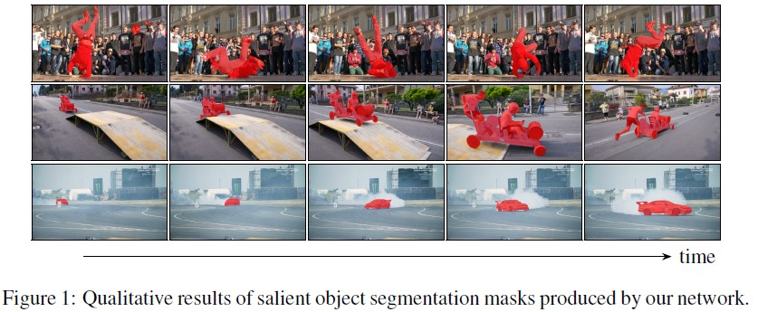
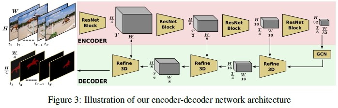
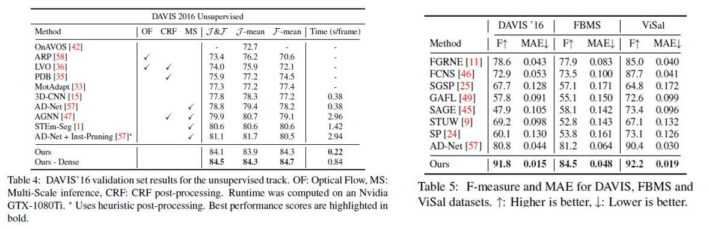

# Making a Case for 3D Donvolutions for object Segmentations in Videos=

## Summary

Suggest a simple and effective **3D Convolution Encoder-Decoder Network to Object Segmenation in Dense Video**

## Model (Architecture)

* Encoder: [3D ResNet pretrained for video action classification](https://arxiv.org/pdf/1904.02811.pdf)
* Decoder: Novel Decoder inspired by exisiting 2D convlutional networks
* Loss: Cross-Entropy loss
* [Feature 1] Faster than existing state-of-the-art methods
* [Featrue 2] Outperforms on three different datasets

## Dataset
* DAVIS' 16: Densely Annotated VIdeo Instance Sementation. Popular set of benchmarks for video object segmentation releasted tasks. 30 videos for training and 20 for validation/testing
* FBMS: Freiburg-Berkeley Motion Segmentation. 59 videos which include 12 videos from the Hopkins-155 dataset
* ViSal: Video Saliency Dataset. 17 videos with a diverse set of object and backgrounds, varying in length from 30 to 100 frames

## Train
- Initialize its weights from a model pre-trained on [IG-65M](https://arxiv.org/pdf/1905.00561.pdf) and [Kinetics](https://arxiv.org/pdf/1705.06950.pdf)
- End-to-End using Adam Optimizer
- Learning rate: 10^-5^
- First Training: synthetically generated video clips from the [COCO Instance Segmentation dataset](https://arxiv.org/pdf/1405.0312.pdf)
- Second Training: video data from the [YouTube-VOS](https://arxiv.org/pdf/1809.00461.pdf) and [DAVIS'16](https://www.cv-foundation.org/openaccess/content_cvpr_2016/papers/Perazzi_A_Benchmark_Dataset_CVPR_2016_paper.pdf)

## Result

[Click Here to Link Original Reference Paper](https://arxiv.org/pdf/2008.11516v1.pdf)

